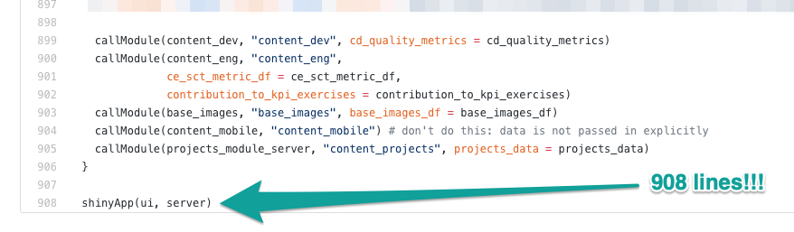
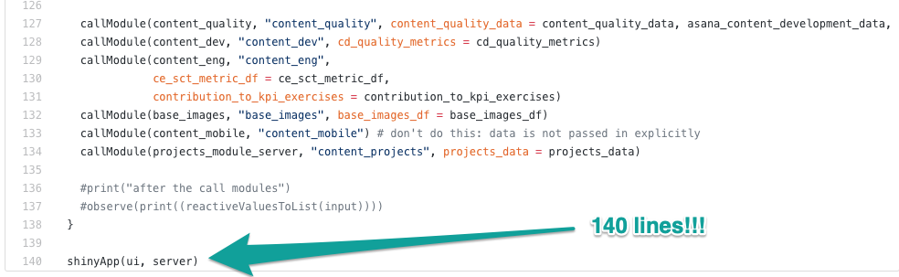
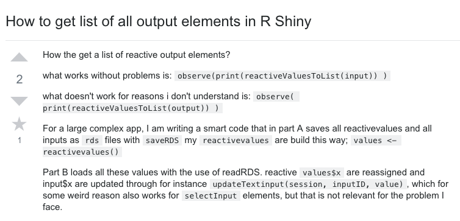
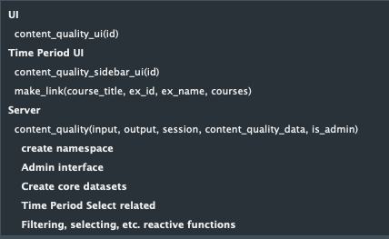

```{r setup, include=FALSE}
options(htmltools.dir.version = FALSE)
library(fontawesome)
```

background-image: url("https://media.giphy.com/media/n0GIZfzgHvUOc/giphy.gif")
background-position: 50% 50%
class: center, inverse

# second subtitle: how I came to fix everything I broke in the first place

---
# Who am I?


- Content Quality Analyst @ [DataCamp](https://www.datacamp.com)
- Lives in NYC (formerly Chicago, New Orleans, and Michigan)
- MS in Biostatistics from Louisiana State University
- BA in Film & Women's Studies from University of Michigan
- Data Scientist/Statistician for 4 years
- Proud human to one beautiful cat, Scully


---
class: inverse, center, middle

# Shiny Modules

---

# What's a Shiny Module, Anyway?

- A smaller piece of a Shiny app that *cannot* be directly run as a Shiny app itself
- Can include input, output, or both
- Can be nested, reused, put into R packages
- Simple or complicated - up to you!
- More details can be found in the [RStudio Shiny Documentation on Modules](https://shiny.rstudio.com/articles/modules.html).

---

# When Should I Be Modularizing My Shiny Code?

- When your `app.R` file gets cluttered and/or long
- If you're putting many different pieces (some disparate) into the same app
- As a personal challenge for Q4 at work to see if you can

---

# Overview of DataCamp's Content Dashboard

Show what you know: [DataCamp's Content Dashboard](http://dashboards.datacamp.com/content/)
<br>\* the login for this will not work for anyone who isn't an `admin` (works at DataCamp) or has an external login (an instructor)

- Inherited when I began on the Content Quality team in June 2018
- Side note: I learned Shiny by taking DataCamp courses on the [Shiny Fundamentals with R Track](https://www.datacamp.com/tracks/shiny-fundamentals-with-r)
- Main app built by [Dave Robinson](https://twitter.com/drob)
- Other parts of app *not* related to CQ are maintainted by other employees @ DataCamp

---

# Example of Shiny Code That Needs Modularizing



Before I modularized the DataCamp Content team Shiny dashboard, our `app.R` file was 908 lines of code.

---

# After Modularizing...



However, after moving the CQ related info out into a module, the `app.R` file is only 140 lines of code - and far more manageable! * 

\* however, that 900 lines of code still exists in the module file - more on how to deal with that at the end of this talk!

---

# Okay, So **How** Do I Modularize my Shiny Code?

- Take all of the code necessary for your part of the app and stick it in a new `.R` file
- New file needs a UI and a Server of its own!
- Be sure to namespace appropriately with `ns()` (more on this in a few slides)
- `callModule()` back in your main `app.R` file

---

# Module UI Function(s)

- UI function should be a meaningful name suffixed with `Input`, `Output`, or `UI`
- Beginning of main UI function in `content_quality_module.R`:

```
content_quality_ui <- function(id) {

  ns <- NS(id) 

  # then the rest of your UI code - tabSetPanel(), ...
}
```

- Needs to start with `ns <- NS(id)` in order to create a namespace function
- You aren't limited to only 1 UI function - my module has 2!

---

# Module Server Function

- Also need to create a namespace in your server:

```
content_quality <- function(input, output, session, 
                            content_quality_data,
                            asana_content_development_data,
                            is_admin) {
  
  # create namespace -------------------------------------
  ns <- NS("content_quality")

  # then the rest of the server code - much reactives + data

```

- Will then contain the rest of your usual server things: Output, tabs, filters, data, graphs, whatever your heart desires

---

# callModule()

- Input:
  - module name
  - module namespace name
  - any datasets needed to work correctly
  - any reactive functions/objects needed to run (more on this soon)
  
- Call this inside of the server function in your `app.R` file:
```
callModule(content_quality, # name
           "content_quality", # namespace/id name
           content_quality_data = content_quality_data, # data
           asana_content_development_data, # data
           is_admin # reactive object
           )
```

- and maybe don't be like me and have named data + unnamed - ????

---

class: inverse, center, middle

# Debugging Your Shiny Module
 
---

# You haven't used ns() enough

You're probably convinced you've wrapped enough of your `input`s and `output`s in an `ns()` function, so as to properly namespace them so they'll render in your app...

**You probably haven't.**

My biggest mistake? Not `ns()`-ing in my server function for the `input`s and `output`s present there, like this `dataTableOutput()` id that I missed:

```
output$admin <- renderUI({
  if (!is_admin()) {
    return(NULL)
  }
  
  box(title = "Logins", 
      dataTableOutput(ns("instructor_logins")),
      width = NULL)
})
```

Search your module for `Input(`, `Output(`, and any `radioButtons()`, plus any other `input`s and `output`s you may have used in your specific app.

---

# Reactive objects vs. Reactive functions

One major mistake I struggled with was when passing `is_admin` to my `call_module()` function:

```
callModule(content_quality, 
           "content_quality", 
           content_quality_data = content_quality_data, 
           asana_content_development_data, 
           is_admin)
```

I continually tried to pass `is_admin` inside of a call to `reactive()`, as if it were a reactive *function*. 

However, `is_admin` is actually a reactive *object* in our code:

```
is_admin <- reactive({
  # is null, for local testing
  is.null(session$user) || session$user == "admin"
})
  ```
  
Be sure you're clear on the difference!

---

# observe(print(reactiveValuesToList(input)))

This was a tip we picked up from [Stack Overflow](https://stackoverflow.com/questions/48431845/how-to-get-list-of-all-output-elements-in-r-shiny) that, when combined with specific `print()` statements to let us know where we'd placed the code, would output all of the `input`s, allowing us to see what was being passed successfully to the app.

```
callModule(content_quality, 
          "content_quality", 
          content_quality_data = content_quality_data, 
          asana_content_development_data, 
          is_admin)
 
# then some more modules

print("after the call modules")
observe(print((reactiveValuesToList(input))))
}
```

We moved this code progressively through the module & `app.R` files with appropriate print statements to match.

---

# Ask for Help

- Seriously though, ask for help.
- I am lucky enough to work with [Dave Robinson](https://twitter.com/drob), who assisted me in modularizing and debugging this app, for which I am incredibly grateful 
- Highly recommend [Stack Overflow Shiny tag](https://stackoverflow.com/questions/tagged/shiny), [RStudio Community](https://community.rstudio.com/), and Twitter as resources for assistance



---

class: inverse, center, middle

# General Tips

---

# Do Yourself a Favor and Add Code Headings


This is a general Shiny/R/life tip, but **do** add code headings to your module and/or Shiny app. I added them after modularizing and it actually changed my life. 

---

# How To Create Code Headings

In my code, this looks like:

```
# Server -------------------------------------------------
content_quality <- function(input, output, session, 
                            content_quality_data,
                            asana_content_development_data,
                            is_admin) {
  
  # create namespace -------------------------------------
  ns <- NS("content_quality")

  # Admin interface  -------------------------------------

    #more code here...
```

Then each comment + any functions defined in that section become a click-through menu at the bottom of my RStudio script which allows me to find different pieces of my module code much quicker.

---

background-image: url("https://media.giphy.com/media/12tRlBD5znA796/giphy.gif")
background-position: 50% 50%
class: center, inverse

# Me after debugging this dashboard

---

class: inverse, center, middle

# Questions + my non-expert answers

---
class: inverse, center, middle

# Find Me After Today

`r fa("paper-plane", fill = "steelblue")`<a href="mailto:kaelen@datacamp.com"></i>&nbsp; kaelen@datacamp.com</a><br>
`r fa("link", fill = "steelblue")`<a href="http://klmedeiros.com"></i>&nbsp; klmedeiros.com</a><br>
`r fa("twitter", fill = "steelblue")`<a href="http://twitter.com/kaelen_medeiros"></i>&nbsp; @kaelen_medeiros</a><br>
`r fa("github", fill = "steelblue")`<a href="http://github.com/klmedeiros"></i>&nbsp; @klmedeiros</a><br>
`r fa("map-marker", fill = "steelblue")`<a href="http://datacamp.com"></i>&nbsp; Content Quality Analyst @ DataCamp</a>